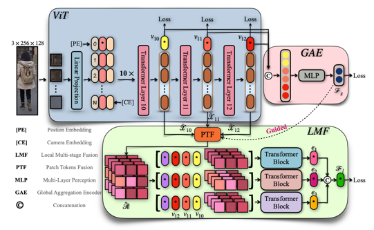
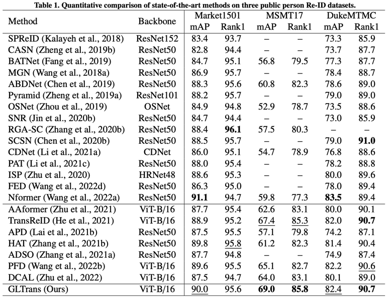
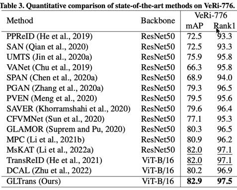
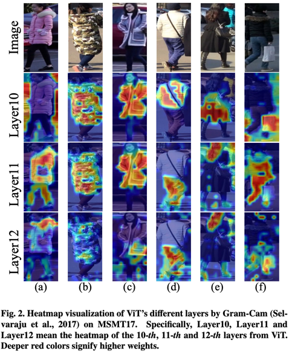
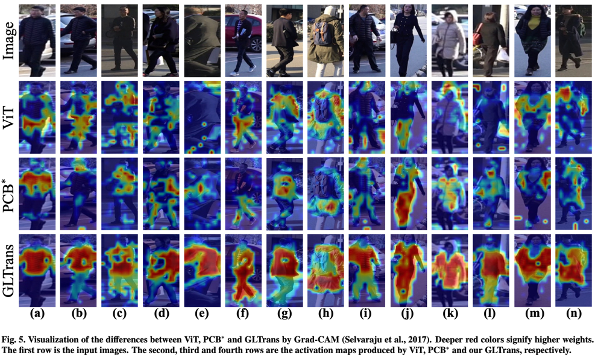
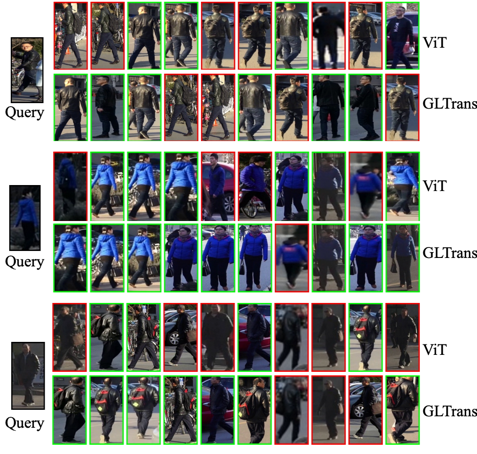

<div align="center">

# Other Tokens Matter: Exploring Global and Local Features of Vision Transformers for Object Re-Identification

<a href="https://arxiv.org/html/2404.14985v1" target="_blank">CVIU 24 Paper</a>

</div>



**GLTrans** is a robust pure Transformer framework for object Re-identification (ReID), designed to capture comprehensive global semantics while mining fine-grained local identity cues. By integrating multi-layer representational capabilities, GLTrans overcomes the limitations of traditional Vision Transformer (ViT) approaches, which often rely solely on the final layer's class token and neglect the rich, fine-grained information embedded in intermediate patch tokens. Through a novel Global Aggregation Encoder (GAE) and a sophisticated Local Multi-layer Fusion (LMF) module, GLTrans effectively aggregates multi-stage class tokens and spatially diverse patch features to enhance feature robustness. Furthermore, its Global-guided Multi-head Attention (GMA) mechanism facilitates a deep interaction between global and local views, ensuring that local discriminative regions are refined by comprehensive global context. Together, these components enable GLTrans to achieve state-of-the-art performance across four large-scale object ReID benchmarks, demonstrating its superior ability to extract compact and complementary representations in complex surveillance scenarios.
# News

Exciting news! Our paper has been accepted by the CVIU 2024! 🎉 [Paper](https://arxiv.org/abs/2509.18715)

# Table of Contents

- [Introduction](#introduction)
- [Contributions](#contributions)
- [Results](#results)
- [Visualizations](#visualizations)
- [Reproduction](#reproduction)
- [Citation](#citation)

# Introduction

Object Re-Identification (Re-ID) aims to identify and retrieve specific objects from images captured
at different places and times. Recently, object Re-ID has achieved great success with the advances
of Vision Transformers (ViT). However, the effects of the global-local relation have not been fully
explored in Transformers for object Re-ID. In this work, we first explore the influence of global and
local features of ViT and then further propose a novel Global-Local Transformer (GLTrans) for high-
-performance object Re-ID. We find that the features from last few layers of ViT already have a strong
representational ability, and the global and local information can mutually enhance each other. Based
on this fact, we propose a Global Aggregation Encoder (GAE) to utilize the class tokens of the last
few Transformer layers and learn comprehensive global features effectively. Meanwhile, we propose
the Local Multi-layer Fusion (LMF) which leverages both the global cues from GAE and multi-layer
patch tokens to explore the discriminative local representations. Extensive experiments demonstrate
that our proposed method achieves superior performance on four object Re-ID benchmarks
# Contributions

- We propose a novel learning framework (i.e., GLTrans) to
take local and global advantages of vision Transformers
for robust object Re-ID.

- We propose the LMF to fuse multi-layer patch tokens for
discriminative local representations. Additionally, we also
present the GAE to aggregate multi-layer class tokens for
comprehensive global representations.

- Extensive experiments demonstrate that our framework
can effectively extract comprehensive feature representations. It achieves outstanding performances on four largescale object Re-ID benchmarks.

# Results






# Visualization 








# Reproduction

### 1) Train

```python
python train.py
```

### 2) Test with pretrained weights

```
python test.py
```

# Citation

If you find GLTrans useful in your research, please consider citing:

```
@article{wang2024other,
  title={Other tokens matter: Exploring global and local features of Vision Transformers for Object Re-Identification},
  author={Wang, Yingquan and Zhang, Pingping and Wang, Dong and Lu, Huchuan},
  journal={Computer Vision and Image Understanding},
  volume={244},
  pages={104030},
  year={2024},
  publisher={Elsevier}
}
```